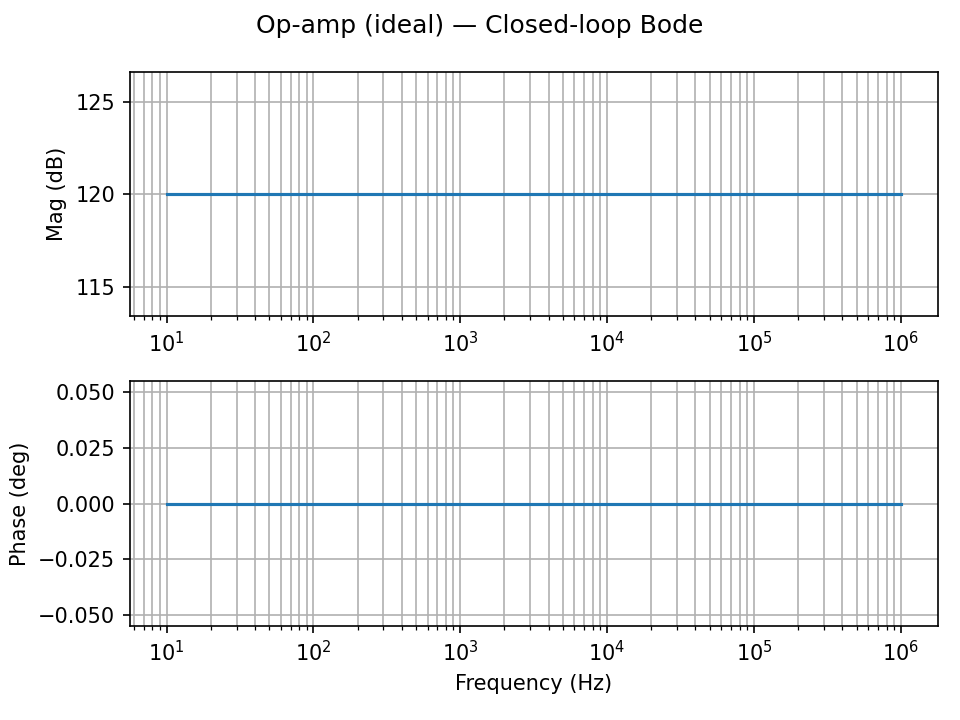

# Op-Amp Stability

Analyze closed-loop Bode and margins using the ideal op-amp helper.



## Inverting topology with ideal OA
```python
from cat import Circuit, GND, opamp_inverting
from cat.core.components import VA, R
from cat.core.net import Net
from cat.analysis import AC, ac_gain_phase, phase_margin, gain_margin_db

c = Circuit("opamp_inv")

# Small-signal input (1 V)
vin = VA(ac_mag=1.0); c.add(vin)

# Output/load node
vout = Net("vout"); load = R("10k"); c.add(load)
c.connect(load.ports[0], vout); c.connect(load.ports[1], GND)

# Inverting amplifier: gain = -Rf/Rin = -100k/10k = -10
opamp_inverting(c, inp=vin.ports[0], out=vout, ref=GND, Rin="10k", Rf="100k", gain=1e6)
c.connect(vin.ports[1], GND)

res = AC("dec", 201, 10.0, 1e6).run(c)
f, mag_db, ph = ac_gain_phase(res.traces, "v(out)")
pm = phase_margin(res.traces, "v(out)")
gm = gain_margin_db(res.traces, "v(out)")
print(pm, gm)
```

Notes:
- The ideal OA is modeled as a high-gain VCVS; no power rails needed.
- Use `plot_bode(ts, y)` to visualize complex AC traces.
- `phase_margin` falls back to estimate if phase is missing; provide complex or phase info when possible.

See also the runnable script under `examples/opamp_stability.py`.
