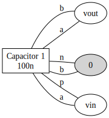
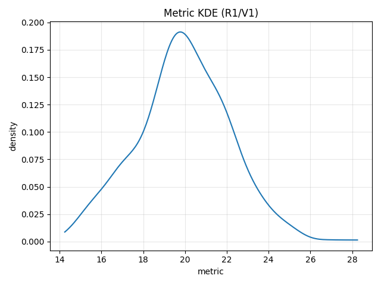
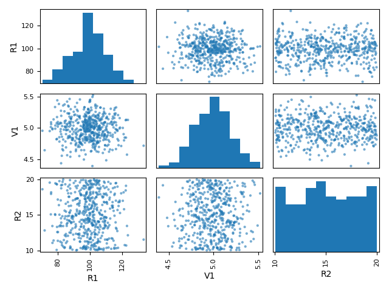

# Circuit Preview (Summary and Graphviz)

Use the Circuit Toolkit preview helpers to validate connectivity and generate a
quick Graphviz-based diagram of nets and components (no schematic rendering).

## Connectivity summary
```python
print(c.summary())
```
Outputs a compact mapping of `ref.port -> net`, highlights nets with degree 1 and unconnected ports.

## Graphviz rendering
```python
dot = c.to_dot()
# render_svg() will call out to the `dot` binary if available; otherwise you can run dot manually:
ok = c.render_svg("circuit_preview.svg")  # requires 'dot' in PATH
```

If Graphviz isn't installed, you still get a `.dot` file:
```bash
dot -Tsvg circuit_preview.dot -o preview.svg
```

Example (RC low-pass):



## Netlist helpers
```python
print(c.netlist_string())
# or
c.print_netlist()
```

## Monte Carlo — quick export & plots
```python
# run a Monte Carlo varying components (example only)
from spicelab.analysis.montecarlo import monte_carlo, NormalPct
from spicelab.core.types import AnalysisSpec

# mapping would be Component -> Dist (here pseudo-code)
# mc = monte_carlo(
#     circuit,
#     mapping,
#     n=100,
#     analyses=[AnalysisSpec('tran', {'tstep': '1e-6', 'tstop': '1e-3'})],
#     engine='ngspice',
#     cache_dir='.spicelab_cache',
# )

# export sampled parameters and the manifest
# mc.save_samples_csv('mc_samples.csv')
# mc.save_manifest_csv('mc_manifest.csv')

# compute a metric per run (example: final Vout) and plot
# metrics = [my_metric(r) for r in mc.runs]
# from spicelab.analysis.viz.plot import plot_mc_metric_hist, plot_param_vs_metric
# fig_hist = plot_mc_metric_hist(metrics, title='Gain distribution')
# fig_scatter = plot_param_vs_metric(mc.samples, metrics, param='R1')
```

Example outputs (generated by `examples/mc_demo_plots.py`):





